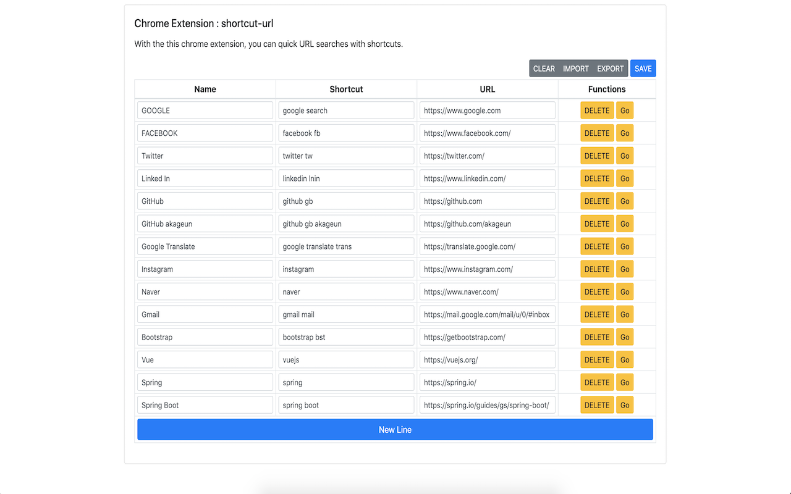
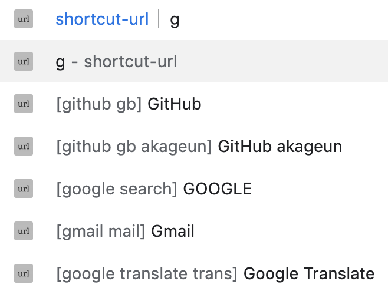

# Shortcut Url
With the this chrome extension, you can quick URL searches with shortcuts.

- You can easily search and move the URL by registering Alias ​​to the desired URL.

## ScreenShot

## Chrome Extension Link
- [Chrome Extension Store](https://chrome.google.com/webstore/detail/shortcut-url/cdfijakdeldlkdhpolimajpelaogimcp)

## Example Json
- [JSON](./example/shortcut_url.json)